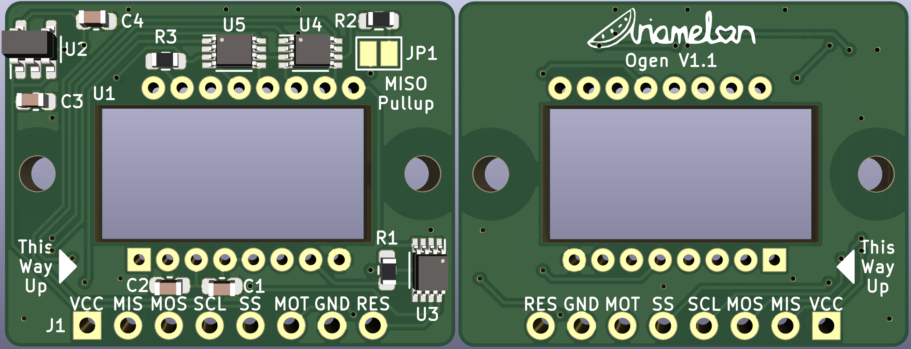

# Ogen
Literally just a PMW3360 SPI Breakout Board. I know there's already [one available on Tindie](https://www.tindie.com/products/jkicklighter/pmw3360-motion-sensor/) but it costs over half the cost of the board just to ship it here in Hong Kong so I thought why not let's make an open-source version. It's 1mm wider, but it shouldn't make a big difference. It's untested so far but it should work.

 

 ## Changelog
 * 30/09/2020: Initial commit.
 * 04/09/2020: Fixed major flaw in PMW3360 footprint.