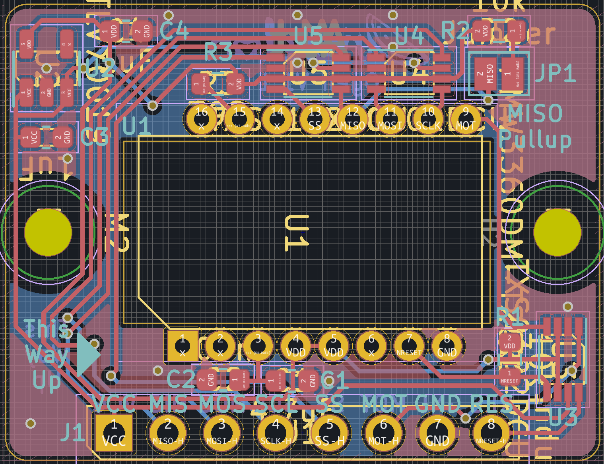
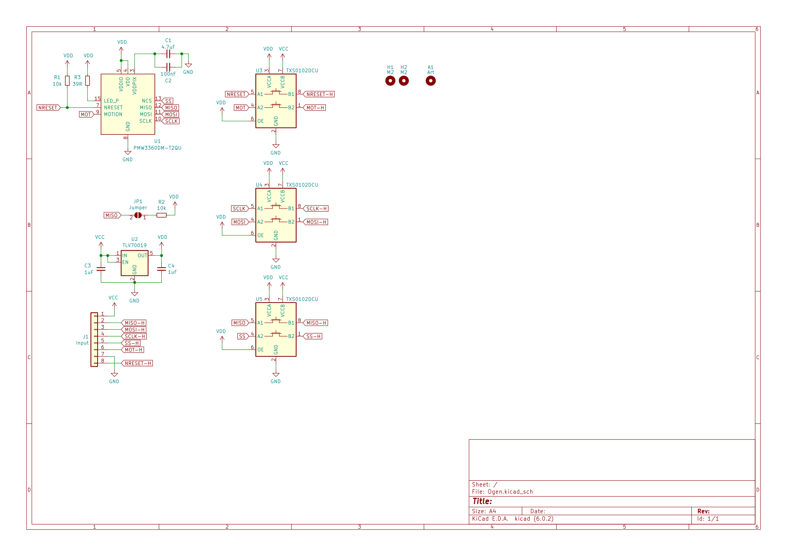

# Ogen
A PMW3360 breakout board based on [this](https://www.tindie.com/products/jkicklighter/pmw3360-motion-sensor/).

 ## Changelog
 * 23/06/2022: Initial update to V1.1. Changed the 5 1-bit shift registers to 3 2-bit ones. Slightly shrunk board. New logo (very important).
 * 04/10/2020: Fixed major flaw in PMW3360 footprint.
 * 30/09/2020: Initial commit.