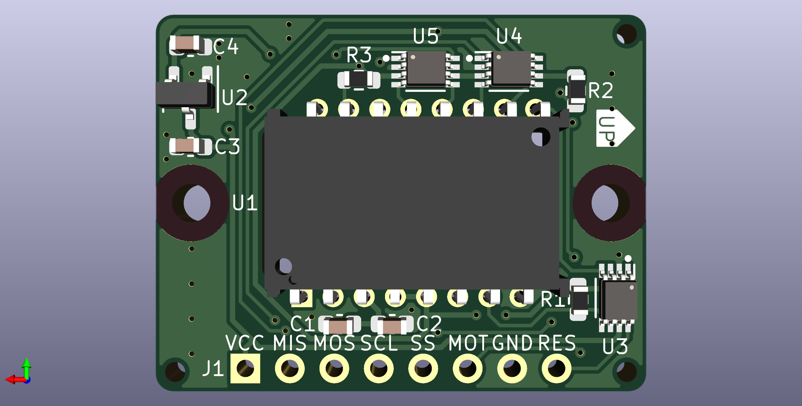
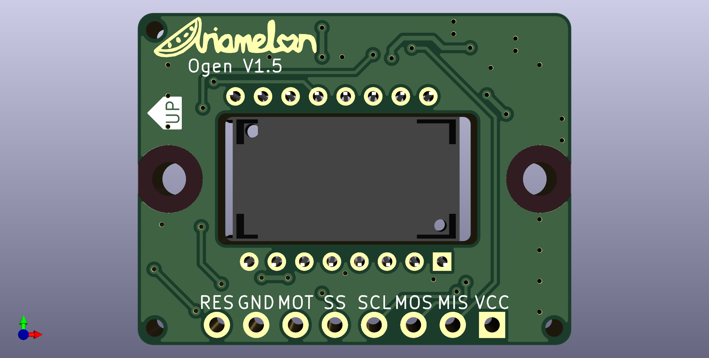

# Ogen Lite
A PMW3360 breakout board. Lite version without shift registers which only works with up to 3v3 VCC and logic.

## Disclaimer
This board is licensed under CC BY 4.0.

 ## Changelog
 * 04/08/2023: Updated to V1.1. Changed capacitors and resistors to 0603. Stitched ground planes together. Removed MISO pullup jumper (MISO is pulled up by default now). Added metadata to schematic and PCB file. Changed location of production files for easier access. 
 * 29/03/2023: Changed logo.
 * 21/03/2023: V1.0 Lite initial commit. No shift registers on board, hence works with 3V3 only.